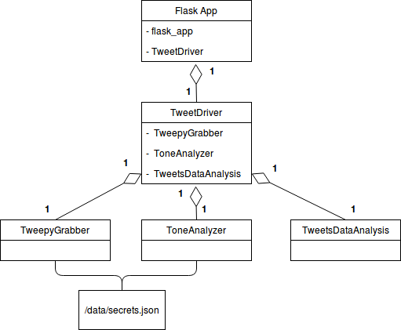
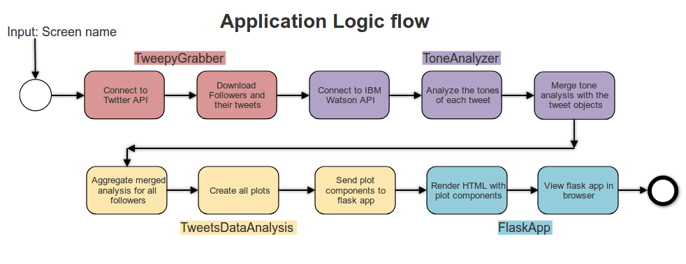
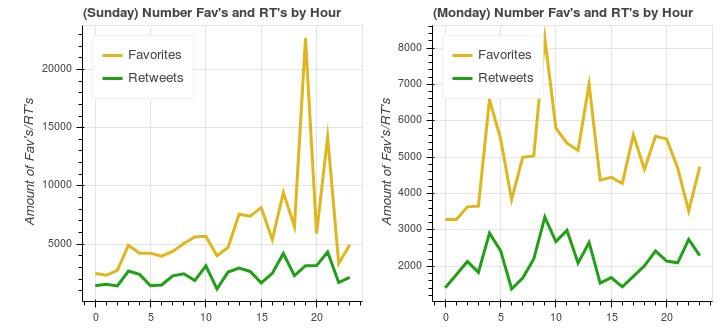
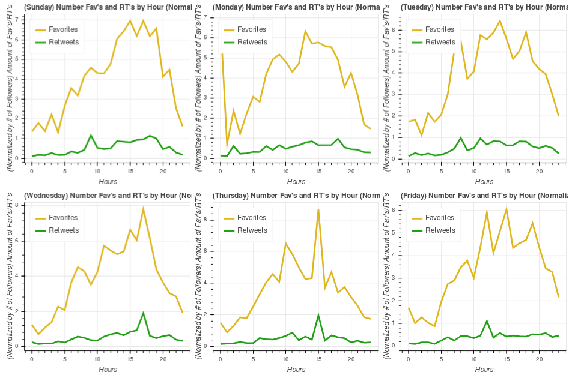
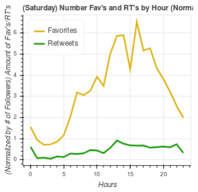
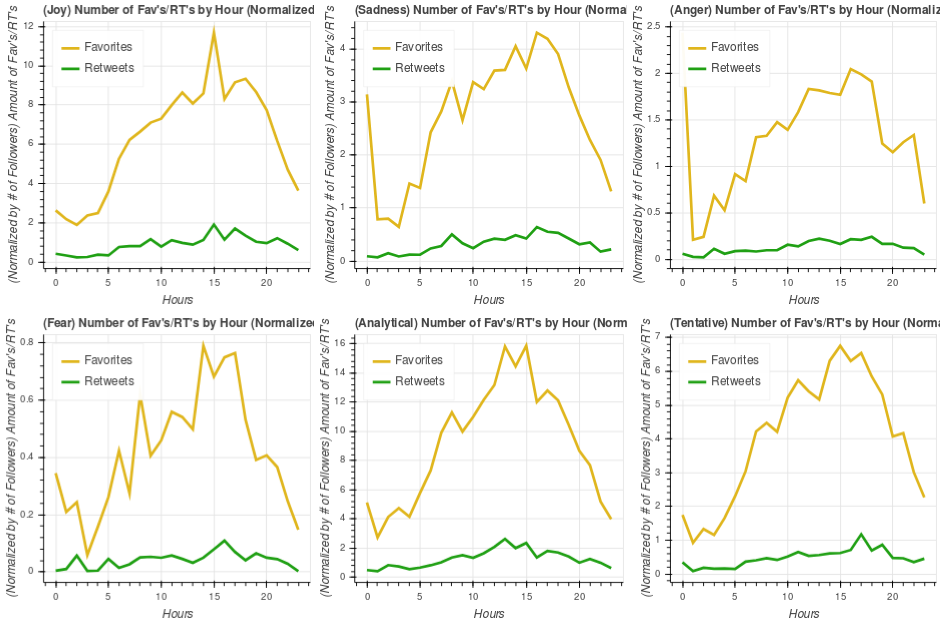
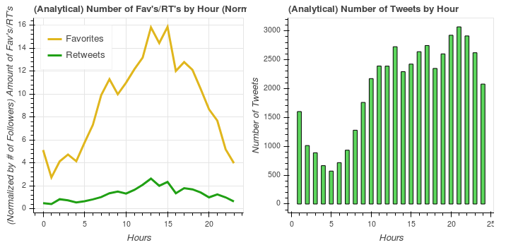

<H1 align="center">How to maximize your tweet potential</H1>

By Patrick Beekman
May 1st, 2018

---
## Abstract
Write my abstract here

**Keywords:** Python, Data Visualization, Twitter, Data Analysis, Bokeh

## Table of Contents
* [Introduction](#Intro)
* [Design, Development and Testing](#DDT)
  * [Design](#Design)
  * [Development](#Development)
  * [Testing](#Testing)
* [Results](#Results)
* [Conclusions and Future Work](#Conclusion)
* [References](#References)

---
<a name="Intro"/>

## Introduction

### Problem, Objective and Users
Twitter can be a wild and confusing place with a plethora of information readily available. The problem is that twitter is constantly being flooded with noise, often times making it difficult for your tweets to gain attention. That was the inspiration for this project, I have studied the best times to tweet, emotions and keywords that should be used to maximize the potential of your tweets and give it the most attention. The goal of this project was to create a simple way for users to analyze the trends of their followers and easily interpret the graphs to determine how to maximize the potential of their next tweet. The application needed to be easy to use because the users of this are not expected to know programming, only to have some basic knowledge of using computers. This application is meant for small business social media marketers so they can get a better idea about the trends of their followers and gear their tweets toward them. Increasingly businesses are using twitter to communicate with their customers/users, but with each new follower it becomes harder to appeal to your followers hence the need for my application. Other users of my application include general twitter users who have something important to say and want to ensure it makes the largest impact on their followers. One example my application could be used is if a user had thoughts or a story to contribute to the #metoo campaign, they may want to make sure as many people hear what they have to say as possible. 

### Relevant Background Information
Unsurprisingly enough twitter does something similar to my application except they have approached the problem from the other side. Instead of your twitter timeline (tweets from all your followers) being displayed chronologically they actually tailor it so tweets they think you will like appear closer to the top of your timeline [[1][1]]. Twitter does this in an attempt to increase the amount of engagements each tweet receives, they define an engagement as the ”total number of times a user interacted with a Tweet. Clicks anywhere on the Tweet, including Retweets, replies, follows, likes, links, cards, hashtags, embedded media, username, profile photo, or Tweet expansion” [[2][2]]. If users are getting more impressions on their tweets they are then likely to use twitter more which is what twitter wants so they can increase their ad revenue. My project approaches from the other side and strives to maximize the potential impressions for a single tweet which in turn can help the user gain more attention on twitter and grow their business or spread a message to their followers. While my application is different from twitter's algorithm it is impossible for them to not overlap. For example the time that a tweet is sent may not be an accurate measure in my analysis because twitter will choose where to place the tweet in a users timeline affecting the time that it is seen by the users followers.

### Problem Scope and features
This project gives the user an overview of the general trends found in their followers. It specifically looks at the trends of when favorites and retweets happen throughout a day and how that relates to the tone of the tweet, the day of the week and the amounts of tweets per hour. It will also show you some keywords found in popular tweets of your followers split by emotion. The user can analyze these graphs on the website themselves to determine an ideal time and content for their tweet. It gives the user an easy way to aggregate all of their followers and view interactive visualizations of these general trends. My application does not give the user a single perfect time and content to tweet about. My application does not take into account replies to tweets, link clicks or other tweet engagement [[2][2]] information that twitter takes into account for their timeline placement algorithm. It does not guarantee more engagement from your followers but simply tries to increase the likelihood that they will favorite or retweet your tweet. 

<a name="DDT"/>

## Design, Development and Testing

<a name="Design"/>

### Design

#### Software Modules

<a name="Figure11"/>

This application was built across five classes to handle the different subsystems of logic. The five classes and how they relate to each other can be seen in UML diagram above [Figure 1.1](#Figure11). An integral piece to the application is the secrets.json file found in the `/data/` folder, it should contain the users Twitter and IBM Watson API keys. More Information on how to get these keys keys can be found in the [Installation and Dependencies section of the Readme](README.md). The TweepyGrabber class handles the connection to the twitter api as well as downloading users followers and tweets. The ToneAnalyzer class handles the connection to the IBM tone analyzer api, analyzing the tone of tweets, and merging this analysis back with the original tweet object. The TweetsDataAnalysis class handles all of the data cleaning, analysis and plotting. The TweetDriver class controls the logic of how those three classes connect with each other, it also passes all of the plot components up to the FlaskApp script. The FlaskApp script simple handles creating the flask application, adding the plots javascript objects to the pages HTML and finally rendering the HTML site.

<a name="Figure12"/>

The logic flow of my application can be seen above in [Figure 1.2](#Figure12). Each color defines a different class where that logic takes place. The application starts when the flask app is run with the twitter screen name as an input parameter and the page is requested in a browser. The FlaskApp object then creates a TweetDriver object to control most of the applications logic flow. The TweetDriver class creates a TweepyGrabber object thus connecting to the Twitter api, note this will only connect if you have the correct keys inside the `./data/secrets.json` file see [Readme for help](README.md). The TweetDriver class then handles the input and feeds it into the TweepyGrabber object to start downloading all of the followers for that user. After that finishes the TweetDriver will get a response containing a list of the users followers, at which point it will download a max of 2,000 tweets for each follower and save this to `./data/SCREENNAME/users_tweets/`. Next the TweetDriver class will create a ToneAnalyzer object which connects to IBM Watson’s tone analyzer API, pending that you have added your keys to the `./data/secrets.json` file. The ToneAnalyzer then parses through each file of users tweets extracting the text into hundred tweet groupings (max per api request) to be sent for tone analysis to the api. These tone analysis’s are then merged back together into the original tweet object and again saved to `./data/SCREENNAME/merged/`. Once the TweetDriver knows that this has been done for each follower it will ask the TweetsDataAnalysis object to aggregate all of the followers merged analysis files together. After aggregation the TweetsDataAnalysis then creates a multitude of plots saving each to `./data/SCREENNAME/plot_components.p`. The logic is then pushed back up to the FlaskApp which adds the plot components to the index HTML page and renders everything. The user can now view the resultant HTML page at http://localhost:5000/. 

#### Libraries Used

| Library | Use |
| ------ | --- |
| [Pandas][pandas] | Made data analysis easy with datetime objects and grouping functionality. Allowed for easy manipulation, reading and writing of json files. |
| [Numpy][numpy] | Useful for data crunching in the TweetsDataAnalysis class. |
| [Tweepy][tweepy] | Quickly and easily connect and use the Twitter api. |
| [Flask][flask] | A quick and simple way to display my plots and analysis on a webpage. |
| [Bokeh][bokeh] | Created all the plots, allowed easy embedding and gave the plots their interactiveness. |
| [Watson Developer Cloud][watson] | A simple way to connect to the watson api in lieu of HTTP requests. |

<a name="Development"/>

### Development
The development of this project has been a roller coaster ride of productivity and confusion. This was in large part because I did not have a solid project idea until six weeks before the end of the semester. Not having a clear and defined goal didn’t seem like much of a risk at the time but should have been addressed and resolved before moving on. I had a vague direction to follow where I knew that I wanted do data analysis on tweets and display my findings on a website. That is where development started with the setup and creation of a simple single page MEAN stack website within the first two weeks. This was a risk for me because I have never done web development before, I thought by setting it up and getting a large part out of the way early it would reduce the risk later on, I later realized this was not the case. Once that was set up I could start working on what I was actually going to display on the site, the twitter analytics.

To start the analytics I first had to download all the data from twitter which was a quick and easy process because of the abundance of resources online. Then came time for the tone analysis of my tweets, at this point I still did not have a clear goal but thought the tones of tweets was interesting and wanted to explore the tweets with that in mind. Using IBM Watson’s api was new to me and a known risk, fortunately the documentation was really helpful and I quickly got this working on a small sample of the downloaded tweets. The first hurdle came when I realized the quirks and limitations of [IBM Watson’s api][watson]. Three weeks later I was able to analyze all of my tweets and merge the tone analysis back with the original tweet objects. 

At this point I still did not know what question I wanted to ask about the collected data and spent a couple of weeks exploring the data. I finally figured out what I wanted to do with my project and settled on analyzing the best times and content to tweet. From here I hastily transitioned to brainstorming some visualizations I wanted and with the help of the [Bokeh library](bokeh) was able to quickly feed my data in and get the graphs I wanted. Once I had some visualizations I then needed to display them on my MEAN stack website, this turned out to be a huge pain that I could not figure out. With time running short I scraped the whole MEAN stack and replaced it with a python flask app. The flask application was easy to understand, implement and embed my plots in. I transitioned and got a working website with my plots in a single night, which is much quicker and less of a pain than the bulky MEAN stack. The last two weeks of the project were then just finalizing my code and adding some new visualizations.

<a name="Testing"/>

### Testing
Creating and keeping up with tests was a challenge for me throughout the project development. I used [pytest][pytest] to automate the testing framework as well as [Travis continuous integration][travis] to keep my github repository clean and functional. I did not follow the agile methodology of test first drive development, mainly because I was unsure what any of my code would look like beforehand. I often times found myself having to program in debug mode and try out multiple things before moving on to the next piece of code.
I started my testing on the TweepyGrabber class which turned out to be harder than I initially thought. It was difficult because I had to write tests that would check for good and bad api connections, as well as finding twitter users to run my tests on. For example testing that my application handles users who have never tweeted, I couldn’t just pick a random user who had never tweeted and hoped that they never did tweet while my test existed. I ended up having to create some basic twitter accounts to simulate these specific users. One of the test twitter accounts got marked as a bot which I had to verify that it was not, for now it is safe but who knows if twitter will mark it as a bot in the future and delete the account. 
Other testing was done on the ToneAnalyzer class which I ran into similar issues specifically with the api requests and reaching api quotas. Testing other methods was easier because I could create test json files and feed those into my methods. I mainly tested the helper methods and less so the control flow methods. For example I tested the method that would parse the tweet object and return a string of cleaned tweets instead of the method that looped through the users tweets and called this method.
I did not test the TweetDriver class for a similar reason stated above because it was just controlling the logic flow of the application. I did not test the TweetsDataAnalysis class either because all of the methods were used to create my visualizations which was not easy to test or defined some basic control flow of creating all the plots. The plotting methods either created the visual that I wanted or it did not, if it didn’t I would know and fix what was necessary. The FlaskApp class was also not tested because of its bare bones nature and time limitations.

<a name="Results"/>

## Results
Within a semester I can proudly say I was able to implement almost all of what I planned. While initially I did not know what my data analysis was going to be, I knew that I wanted to analyze tweets from twitter and display my findings on a website which is what I did. This project allows anyone to easily analyze the general trends specific to their followers or any generic user and view these findings on an interactive website to determine when and what you should ideally tweet about to maximize the potential of favorites and retweets for your tweet. 

### Findings
To really understand the project it is important to interpret the plots and results that appear on the website. Currently the website walks through how to analyze each of the graphs and points out some interesting pieces from the graphs produced from running the application on my twitter account and that is how I will describe my findings here as well. 

<a name="figure21"/>

The bar graph above [Figure 2.1](#figure21) shows the amount of tweets for each day of the week. If we are looking to maximize the potential that our tweet has we have to consider two things, the amount of other tweets and the amount of people scrolling on twitter that day. Looking at the graph we see that on the weekends there are substantially less tweets (about 16% less) which might be an indicator that there are less people on twitter then as well. Just from this graph it seems you should tweet during a weekday when there are the most people to potentially see and favorite/retweet your tweet. This plot is not enough to determine that, supplemental information is necessary. 

<a name="figure22"/>

Above in [Figure 2.2](#figure22) the two graphs are showing the same thing just for different days (Sunday and Monday left to right). The graphs show the raw number of favorites and retweets for each hour of that day of the week. As you can see Sunday has a massive spike at hour 19 (7pm) but this doesn’t make sense, we would expect for the graph to be a little more gradual and not so jagged. This is because it treats each users tweets equally, if one user has a lot of followers who can favorite/retweet their tweets and they so happen to tweet at specific hours then that will appear in the graphs and skew the analysis. To fix this issue I have normalized each users tweet by the amount of followers they have. For example a popular user with 100,000 followers and gets 10,000 favorites will have a normalized value of 0.1 while an average user with 100 followers and 10 favorites will also have a normalized value 0.1. This is a more accurate representation of favorites and helps to smooth out the plots as seen below in [Figure 2.3](#figure23) the normalized graphs of Sunday and Monday. 

<a name="figure23"/>

Now using the normalized graph we can answer the question of whether you should tweet on a weekday or a weekend? A good comparison of the two days can be found by looking at the peak hours of favorites/retweets. Sunday has a sustained peak from 13 (1pm) to 19ish (7pm) averaging about 6-7 normalized favorites, meanwhile Monday has a somewhat sustained peak from hour 12ish to 18ish (6pm) averaging around 5-6 normalized favorites. This is surprising given what we found in the [bar chart above](#figure21), we assumed because there were less tweets on Sunday that there were less people online therefore less people to potentially favorite/retweet your tweet. This does not appear to be the case, there are less people and a higher average amount of favorites on Sunday compared to Monday. Comparing all of the days it seems that Sunday appears to be the best day, check for yourself with the rest of the days below in [Figure 2.4](#figure24).

<a name="figure24"/>

Another important thing to think about before you tweet is the content and tone of that tweet. Looking at the normalized amount of favorites and retweets broken down by emotion can give us some insight into this, plotted in [Figure 2.4](#figure25) below. In the graphs we notice that analytical and joyus tweets have peaks at 12 and 16 respectively which is much higher than the other emotions. This is likely in part because people tweet a lot of happy and analytical tweets but also that there is high response rate to those tweets as seen by the heightened amount of favorites and retweets. Tweeting something Analytical or Joyus is in the users best interest to maximize the potential of getting favorites or retweets.

<a name="figure25"/>

Simply just tweeting when the most favorites occurs is not the best solution, a better solution would be to compare this with the amount of tweets happening each hour for that emotion. Below is a side by side graph comparing the Analytical graph ([Figure 2.6](#figure26)) which we just decided would be a good emotional tone for your tweet in the last paragraph. 

<a name="figure26"/>

Looking at the two graphs side by side for the Analytical emotion we want to find a time that maximizes the amount of favorites and reduces the amount of tweets. Two good times to tweet that I notice are at 8am when there is the local peak of around 11 normalized favorites and only 1279 tweets for that hour. The other is at hour 15 (3pm) where there’s about 16 normalized favorites and 2424 tweets per hour which is about 200-300 tweets less than the surrounding hours. Other graphs include the most popular word counts of users top tweets grouped by emotion which can be helpful to determine keyword choice. 

All in all the ideal time to tweet to maximize the amount of favorites and retweets based on my followers is Sunday at either 8am or 3pm and I should tweet something analytical. 

### Features
The core functionality of my application got finished within the semester, unfortunately I was not able to finish some features. The two biggest unfinished features that I would have liked to get done are hosting the site online for anyone to view and then to optimize my code so that it runs much quicker. If I took the time to optimize my code and remove code blockers I think I could get it to run in about half the time as it takes right now.

| Implemented | Not Implemented |
| ------------ | ------------ |
| Connect to Twitter api | Host on AWS to be accessible anywhere |
| Download Twitter followers and tweets | Stylize the website with CSS |
| Connect to IBM Watson Tone Analyzer | Remove code blockers and generally optimize the code |
| Analyze the tone of a group of tweets | Visualize the network of my followers |
| Create a website to host results | Take into account emojis during my analysis |
| Create plots to visualize my analysis |  |
| Make the plots interactive |  |
| Generalize my application to any user |  |

### Problems encountered, accuracy of estimates
The biggest problem that I faced throughout this project was not having a well defined goal. I knew that I wanted to analyze tweets and display them on a website but I did not know what question I wanted to ask of the data. After I got to point in my project where I could download and analyze the tone of tweets I got stuck and just did some exploratory analysis for two to three weeks before finally deciding on my current analysis. Another problem was unit testing, I found this very difficult to do for this project and spent a lot of time creating and debugging my tests while my code was working correctly. Another problem I ran into was with all the MEAN stack stuff. It was overkill for my project and bogged down my development, that is why I switched to using a Flask app instead because it was much simpler and barebones. My accuracy of estimates was on schedule, even with the problems I encountered I was still able to implement most of the features I wanted. I did underestimate the amount of time it would take me to get a MEAN stack site running with all my plots embedded, hence why I switched to the simpler Flask app.

<a name="Conclusion"/>

## Conclusions and Future Work
Conclusion.

<a name="References"/>

## References
\[1\]: https://help.twitter.com/en/using-twitter/twitter-timeline

[1]: https://help.twitter.com/en/using-twitter/twitter-timeline

\[2\]: https://help.twitter.com/en/managing-your-account/using-the-tweet-activity-dashboard

[2]: https://help.twitter.com/en/managing-your-account/using-the-tweet-activity-dashboard

### Libraries
pandas: https://pandas.pydata.org/

[pandas]: https://pandas.pydata.org/

numpy: http://www.numpy.org/

[numpy]: http://www.numpy.org/

tweepy: https://github.com/tweepy/tweepy

[tweepy]: https://github.com/tweepy/tweepy

flask: http://flask.pocoo.org/

[flask]: http://flask.pocoo.org/

bokeh: https://bokeh.pydata.org/en/latest/

[bokeh]: https://bokeh.pydata.org/en/latest/

watson: https://www.ibm.com/watson/developer/

[watson]: https://www.ibm.com/watson/developer/

pytest: https://docs.pytest.org/en/latest/

[pytest]: https://docs.pytest.org/en/latest/

travis: https://travis-ci.org/

[travis]: https://travis-ci.org/
