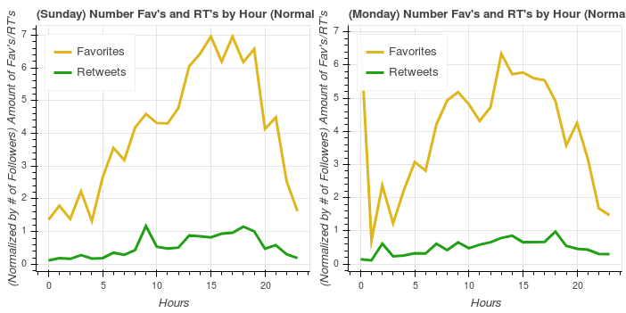
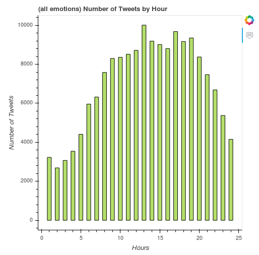

# TweetMaximizer

[](https://travis-ci.org/patrickbeekman/SeniorCapstone)

An application to analyze the trends of your followers so you can maximize the potential of your tweets. My analysis looks at when and you should tweet about so you can gain the largest amount of favorites and retweets. This can be useful for businesses and advertisers who want to ensure each of their tweets makes the largest impact on their followers to help grow the businesses image on twitter. While useful for businesses it is also a great tool for twitter users who have something important to say and want to make sure the news gets spread! For example you may have something important to add to the [#metoo campaign](https://en.wikipedia.org/wiki/Me_Too_movement) so you can use this application to find the best times to tweet and some keywords/emotional tones you may want to think about while drafting your tweet. Shown below are some examples of visualizations on the website that users can analyze to help determine an ideal time to tweet.

| Normalized graph of Favorites and Retweets by hour | Amount of tweets by hour |
| -------- | ---------- |
|  |  |

<a name="installation-and-dependencies"/>

## Installation and Dependencies

This project use a python Flask app to display my findings. To get started you will first need to clone this repo to your workspace.
* You will then need to install [anaconda python 3.6](https://conda.io/docs/user-guide/install/index.html)
* You will then need to install these python packages, which you can easily install these with [python package manager pip](https://pip.pypa.io/en/stable/installing/).
  * Pandas ```pip install pandas```
  * Numpy ```pip install numpy```
  * tweepy ```pip install tweepy```
  * Flask ```pip install flask```
  * Bokeh ```pip install bokeh```
  * Watson Developer Cloud ```pip install --upgrade watson-developer-cloud```
* Create a twitter app to get your api keys, this allows you to connect to the twitter api
  * Create a Twitter account if you don't have one already
  * Go to the [Twitter application site](https://apps.twitter.com/)
  * Click 'Create New App' up in the top left
  * Fill out the required information
  * When your app is created click on 'Keys and Access Tokens' in the top middle of the page
  * Save the 'Consumer Key' and 'Consumer Secret' (you will use this later to run the application)
* Create an IBM Cloud account to get your Tone Analyzer api keys
  * Create an IBM Cloud account and login
  * Go to the [Tone Analyzer services page](https://console.bluemix.net/catalog/services/tone-analyzer)
  * Choose the free Lite account
  * Save the username and password seen down in the credentials section (you will use this later to run the application)

## About and Usage

This application can be used at a very high level by:
1. [Clone/Download the repository](https://services.github.com/on-demand/github-cli/clone-repo-cli)
2. Navigate to wherever you cloned/downloaded the repository
  * Inside the `data` folder should be a file called secrets.json which is where you can store your api keys
  * Store your twitter username and password inside the repsective field replacing your key with the text `key goes in here`
3. Navigate back out of the data folder to the home directory and then into the src folder where flask_app.py is located.
4. Open up a terminal at the location navigated to in step 2 and execute ```python flask_app.py SCREEN_NAME``` replacing the screen name with the twitter user you would like to analyze. (the screen name is the @name not the other one)
5. Now wait for the script to execute, Depending on the amount of followers the user has this can take a while. For about 200 followers it can take about [15-30 minutes initially**](#Note1).
6. Once the script has finished executing the website should now be viewable at localhost:5000/ in your favorite web browser.

## Developer Instructions

### Setting up developer environment
Setup developer environment? Huh?
* Code style checking is done with [PEP8](https://www.python.org/dev/peps/pep-0008/) and handled automatically with the [Python Pycharm IDE](https://www.jetbrains.com/pycharm/).

### Testing
All tests were written using [pytest](https://docs.pytest.org/en/latest/).
* Follow the [installation and dependencies section](#installation-and-dependencies)
* Clone the repository
* Open a terminal and navigate to the repository
* Run ```pytest``` in the terminal

### Contribution
This project is not open source although anyone is free to fork or download my application and modify it however you see fit.

## Resources

* [Project proposal](ProjectProposal.md)
* [Final Technical Report](FinalTechnicalReport.md)

## Notes

<a id="Note1">**</a> Note that it will only take this long the first time you run this script on a user. The reason this process takes so long requires some understanding as to what the scripts are doing. Below describes the process:
* Downloads all of the users followers from twitter
* Downloads ~2000 tweets for each of those followers
* Analyzes the tone of each tweet
* Aggregate all of the collected data
* Create the interactive plots of the data
* Send the plots to the Flask app which inserts them into the HTML
* And finally it hosts it locally so you can now view the finished product
Now hopefully you have a better idea of what this application is, how it works and how you can run this on any twitter user.
